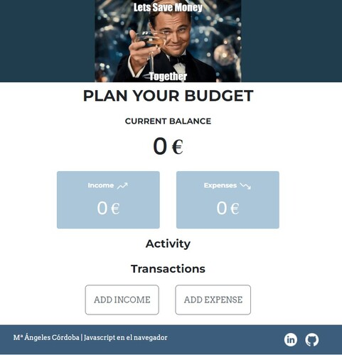
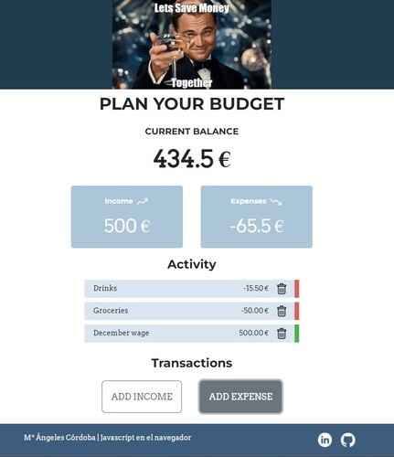
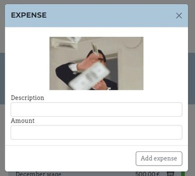

## Control de gastos
Aplicación web desarrolada para el módulo de Javascript en el navegador del Bootcamp Mujeres en Tech de KeepCoding.
La aplicación nos ayuda a gestionar nuestros ingresos y gastos, con el objetivo de conocer el dinero que tenenos ahorrado.

## Carácterísticas
. La aplicación muestra en todo momento el total de gastos, ingresos y el dinero total que tenemos ahorrado.
. Podremos añadir un ingreso o un gasto incluyendo un concepto.
. Podremos borrar cualquier gasto o ingreso que hayamos introducido.
. Si cerramos la web y volvemos a entrar, tenemos que recuperar todos los gastos e ingresos que habíamos introducido, así como el ahorro total.

## Control de errores
. Al añadir un ingreso o un gasto, no podremos añadir campos vacios ni valores negativos.
. No podremos añadir un gasto, si es mayor que el dinero total que tenemos, para evitar quedarnos en negativo. 

## Ejemplo

